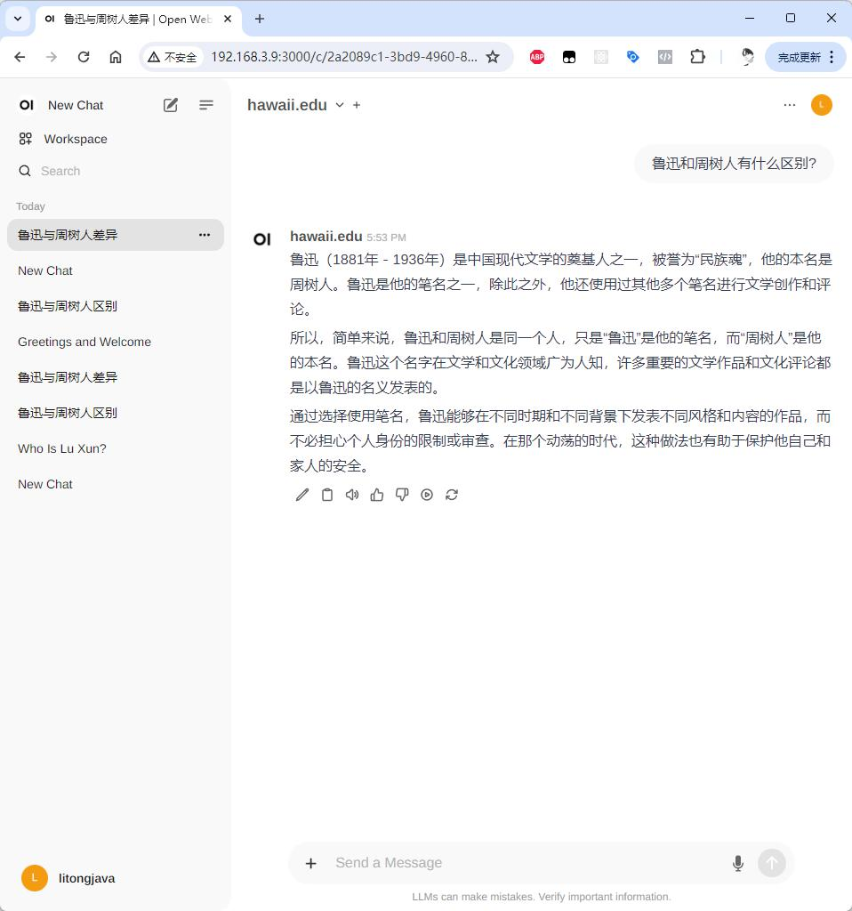

# open-chat-server

基于 Java 语言的大模型后端应用开发框架，目前已经支持 open-webui。

## 主要功能
- 1.执行linux命令
- 2.执行python代码
- 3.执行javascript代码
- 4.执行golang代码
- 5.执行c and c++ 代码

## 启动

```sh
EXPORT OPENAI_API_KEY=""
java -jar target/open-chat-server-1.0.jar
```

启动后监听 80 端口，例如，我的 IP 地址是 `http://192.168.3.8`。

## 使用 open-webui 对接

```sh
docker run -d -p 3000:8080 \
  -v open-webui:/app/backend/data \
  -e OPENAI_API_BASE_URLS="http://192.168.3.8/openai/v1" \
  -e OPENAI_API_KEYS="contact https://github.com/litongjava" \
  --name open-webui \
  --restart always \
  ghcr.io/open-webui/open-webui:main
```

指定 `OPENAI_API_BASE_URLS` 为 open-chat-server 后端 IP，`OPENAI_API_KEYS` 可以随便填写，open-chat-server 会自动解析报文，并替换为指定的 `OPENAI_API_KEY`。

## 发送消息测试

测试效果：



## 消息流程

1. web 界面输入消息（这里是 open-webui）。
2. open-webui 将消息转发到应用端（这里是 open-chat-server）。
3. open-chat-server 将消息发送到大模型（这里是 OpenAI ChatGPT）。
4. ChatGPT 返回消息到 open-chat-server，open-chat-server 再将消息返回到 open-webui，open-webui 展示消息。

## 二次开发

开发者可以对 open-chat-server 进行二次开发，开发特定领域的 AI 代理。