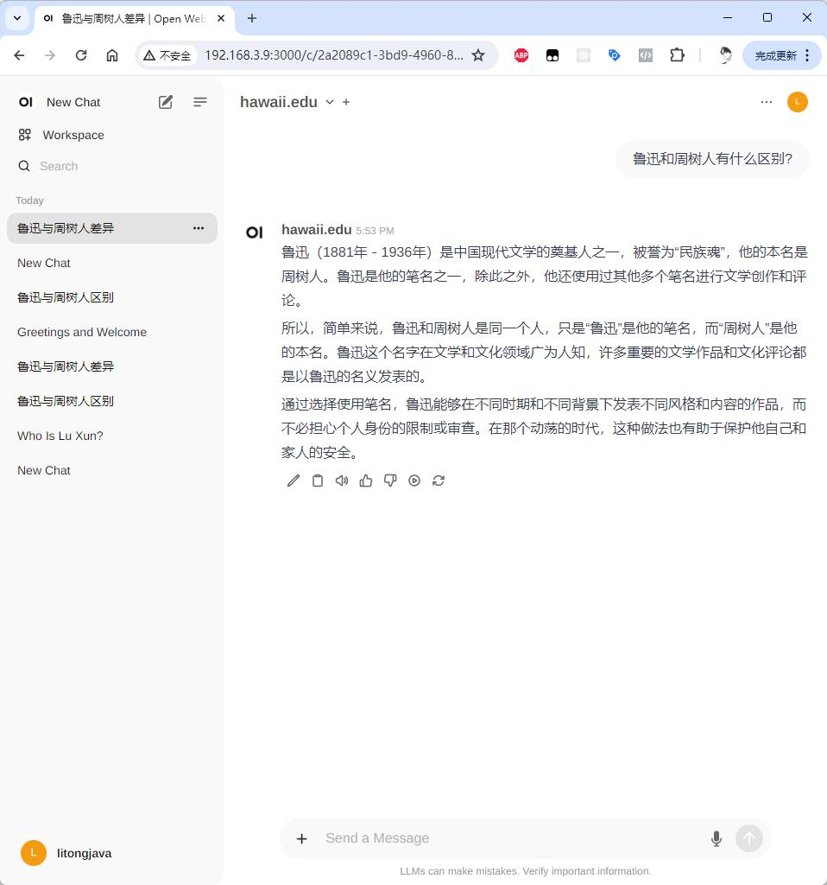

# open-chat-server

A backend application development framework for large models based on the Java language, now supporting open-webui.

## Getting Started

### Launch

```sh
EXPORT OPENAI_API_KEY=""
java -jar target/open-chat-server-1.0.jar
```

Once launched, it listens on port 80. For example, my IP address is `http://192.168.3.8`.

### Integration with open-webui

```sh
docker run -d -p 3000:8080 \
  -v open-webui:/app/backend/data \
  -e OPENAI_API_BASE_URLS="http://192.168.3.8/openai/v1" \
  -e OPENAI_API_KEYS="contact https://github.com/litongjava" \
  --name open-webui \
  --restart always \
  ghcr.io/open-webui/open-webui:main
```

Set `OPENAI_API_BASE_URLS` to the backend IP of `open-chat-server`. The `OPENAI_API_KEYS` can be any string; `open-chat-server` will automatically parse the message and replace it with the specified `OPENAI_API_KEY`.

### Sending Test Messages

Test the setup:



## Message Flow

1. The web interface receives the input message (from open-webui).
2. open-webui forwards the message to the application backend (open-chat-server).
3. open-chat-server sends the message to the large model (OpenAI ChatGPT).
4. ChatGPT returns the message to open-chat-server, which in turn sends it back to open-webui.
5. open-webui displays the message.

## Custom Development

Developers can customize `open-chat-server` for specific domain AI agents.

---

If you need any more adjustments or additional information, feel free to let me know!